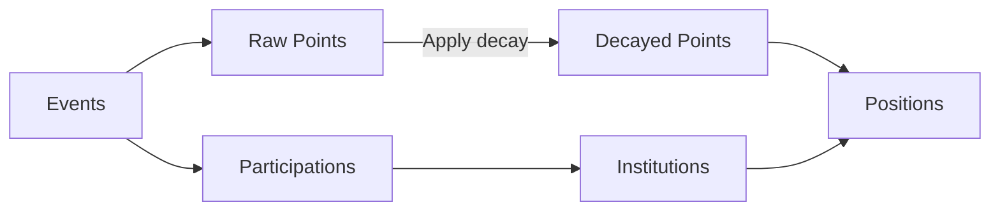

# Crunch's Global Leaderboard

This repository contains the core implementation of the [Crunch Global Leaderboard](https://hub.crunchdao.com/leaderboard).

> [!WARNING]
> This code is not runnable outside of the platform's internal infrastructure. The code is only publicly available for review and proposal.

- [Crunch's Global Leaderboard](#crunchs-global-leaderboard)
- [How it works](#how-it-works)
  - [Events](#events)
  - [Raw Points](#raw-points)
    - [Legacy Competitions](#legacy-competitions)
  - [Decayed Points](#decayed-points)
  - [Participations \& Institutions](#participations--institutions)
  - [Positions](#positions)
- [Contributing](#contributing)
- [License](#license)

# How it works



## Events

When you appear on a [Competition](https://docs.crunchdao.com/other/glossary#competition)'s leaderboard, it creates an event that will become active once the [Crunch](https://docs.crunchdao.com/other/glossary#crunch) is over.

An event may be ineffective if:
- Your rank is lower than 500.
- You are not eligible for a reward on the leaderboard, e.g. the system detected a [duplicate submission](https://docs.crunchdao.com/competitions/leaderboard/duplicate-predictions).

## Raw Points

Points are based on the size of the competition prize pool and your rank on the leaderboard. For continuous competitions, the annualized number is used.

Then, a list of weights is applied:

1. The weight of the best rank of the [user's group](https://docs.crunchdao.com/competitions/leaderboard/duplicate-predictions#grouping) is based on a [power law distribution](https://en.wikipedia.org/wiki/Power_law).
   - If you participate alone, your highest model rank is used.
   - If you participate as a team, the highest rank of each team member is used. <br />
     Members who do not appear are also awarded points, but only on the private leaderboard.
   - For real-time competitions such as [Falcon](https://hub.crunchdao.com/competitions/falcon) or [Synth](https://hub.crunchdao.com/competitions/synth), your rank on the payouts is used.

2. The weight of each leaderboard's target as each target may have a different prize pool. <br />
   For example, [DataCrunch (v1)](https://hub.crunchdao.com/competitions/datacrunch) has the following distribution:
   | Target | Prize Pool | Weight |
   | --- | --- | --- |
   | `white` | 10,000 | ~0.09 |
   | `red` | 20,000 | ~0.18 |
   | `green` | 20,000 | ~0.18 |
   | `blue` | 60,000 | ~0.55 |

3. The Phase's per-crunch weight:
   - [Public leaderboards](https://docs.crunchdao.com/other/glossary#submission-phase) are usually worth ~10%,
   - while [private leaderboards](https://docs.crunchdao.com/other/glossary#out-of-sample-phase) are usually worth ~90%. <br />

   These weights are also divided by the competition's duration in crunches. For continuous competitions, the weight is divided by one year only.

The following formula is executed for each event, i.e., one per user and leaderboard (or crunch):

``` math
\text{prize\_pool} \times \text{rank\_weight} \times \text{target\_weight} \times \text{phase\_weight}
```

### Legacy Competitions

Submissions and rankings from the DataCrunch (Legacy) competition are also taken into account. Since the system was quite different, the weights had to be chosen carefully in order to continue rewarding those who have been here since the beginning.

## Decayed Points

Over time, the event will have a smaller and smaller impact. The following decay formula is used for this purpose:

```math
\text{decay\_factor} = e^{-\frac{\text{today} - \text{event\_start}}{\text{decay\_constant}}}
```

Then, the raw points are multiplied by this factor to determine the number of points for a given date.

## Participations & Institutions

Participation is considered when a user registers for a competition. This is now used to represent your institution on the Institution Global Leaderboard.

It's easier for an institution with more members to appear at the top, but it's not guaranteed (quality versus quantity).

In order to join an institution, you must select the correct university in your profile. You will then be automatically added to the next Global Leaderboard release.

If you are the first, an institution will be created with your university's name. The "About" page will feature a reworded version of your university's website description, crafted by an LLM for a more polished look. If you would like to contribute information to your institution's page, such as links, the "About" section, an avatar, or a banner, please [contact us on Discord](https://discord.com/invite/veAtzsYn3M).

## Positions

After completing all the previous steps, the leaderboard positions are finally computed and ranked.

A history is kept so you can see your progress over the years.

# Contributing

Since you will not be able to test the code locally, contributions should only be made via proposal. We encourage you to create an issue to share your ideas.

# License

[MIT](https://choosealicense.com/licenses/mit/)
